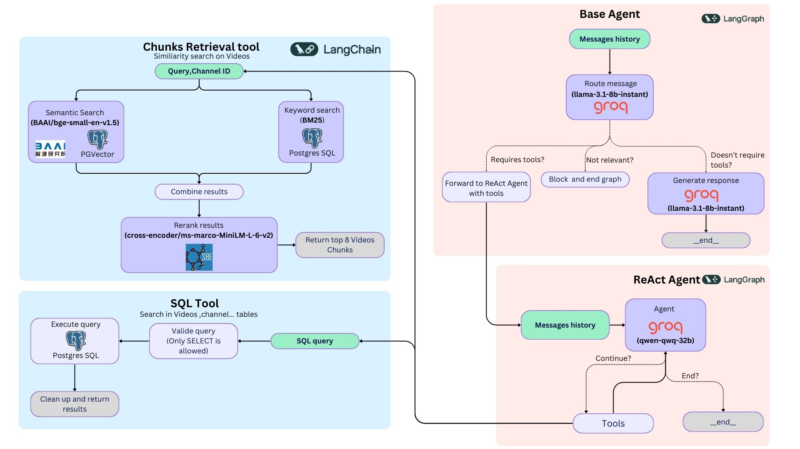

# 🔴 YT Navigator

## 📋 Overview

YT Navigator is an AI-powered application that helps you navigate and search through YouTube channel content efficiently. Instead of manually watching hours of videos to find specific information, YT Navigator allows you to:

1. **🔍 Search through a channel's videos** using natural language queries
2. **💬 Chat with a channel's content** to get answers based on video transcripts
3. **⏱️ Discover relevant video segments** with precise timestamps

## ✨ Main Features

- **🔐 Authentication**: Secure login and independent sessions
- **📺 Channel Management**: Scan up to 100 videos per channel and get a summary
- **🔍 Search**: Find relevant video segments using Semantic Search
- **💬 Chat**: Have conversations with an AI that has knowledge of the channel's content

## 🧰 Technology Stack

- **🖥️ Backend**: Django, PostgreSQL, PGVector, Structlog
- **🧠 AI & ML**: LangGraph, Sentence Transformers, BM25, Groq (qwen-qwq-32b, llama-3.1-8b-instant)
- **⚙️ Data Processing**: BeautifulSoup, Scrapetube, youtube-transcript-api
- **🎨 Frontend**: Django templates with modern CSS

## 🔄 Architecture Overview

The system architecture consists of three main components:

- **Chunks Retrieval Tool**: Combines semantic search (using BAAI/bge-small-en-v1.5 and PGVector) with keyword search (BM25 on PostgreSQL) to find relevant video segments. Results are reranked using a cross-encoder model to return the most relevant video chunks.
SQL Tool: Provides a secure interface for database queries, limited to SELECT statements only, to retrieve information from the Videos and channel tables.
Agent System: Consists of two interconnected agents:

- **Base Agent**: Uses llama-3.1-8b-instant on Groq to route queries based on their nature (tool-requiring, irrelevant, or directly answerable)
ReAct Agent: Uses qwen-qwq-32b on Groq to handle complex queries requiring tool assistance in a recursive reasoning pattern


This architecture enables efficient information retrieval and natural conversation about YouTube content.

## 🚀 Installation

### 💻 Without Docker

1. Clone the repository and create virtual environment
   ```bash
   git clone https://github.com/yourusername/yt-navigator.git
   cd yt-navigator
   python -m venv venv
   source venv/bin/activate  # On Windows: venv\Scripts\activate
   pip install -e .
   ```

2. Set up environment and database
   ```bash
   cp .env.example .env
   python manage.py migrate
   ```

3. Run the server
   ```bash
   make dev  # for development
   make prod  # for production
   ```

### 🐳 With Docker

1. Set up environment and run
   ```bash
   cp .env.example .env  # Make sure POSTGRES_HOST=db
   make build-docker
   make run-docker
   ```

## 📖 Usage

1. **📝 Register and Login** to get started
2. **🔗 Connect a YouTube Channel** by entering its URL
3. **📥 Scan Videos** (choose quantity - up to 100)
4. **🔍 Search for Information** across all videos
5. **💬 Chat with the Channel** AI about content

## 📈 Version Information

Current version: 0.1.2 (March 2025)

**Recent Changes**: Added Langsmith dataset creation and example addition

**Known Issues**: Poor exception handling, UI mobile issues, English-only support

## 👥 Team Contributions

| Team Member | Areas of Contribution |
|-------------|------------------------|
| Ramy Solanki | • System architecture and backend development<br>• Django app structure and core functionality<br>• Semantic search with PGVector<br>• Docker and deployment setup |
| Advaith Krishna Vasisht | • LangGraph conversational agent<br>• Embedding pipeline using Sentence Transformers<br>• Hybrid search algorithm (vector + BM25)<br>• Transcript processing and segmentation |
| Swara Joshi | • UI/UX design and implementation<br>• Chat interface with async messaging<br>• Search result visualization<br>• Documentation and testing |

## Important Links

- **GitHub Repository**: https://github.com/Swara-Joshi/YT-Navigator
- **Live Application**: https://www.generalming.me
- **Demo Video**: https://youtu.be/kYLsUgWuFL8
  
### Code Standards

We use Black for formatting, Ruff for linting, and isort for import sorting, enforced with pre-commit hooks.

```bash
pre-commit install
pre-commit run --all-files
```

## 📄 License

This project is licensed under the MIT License - see the LICENSE file for details.
